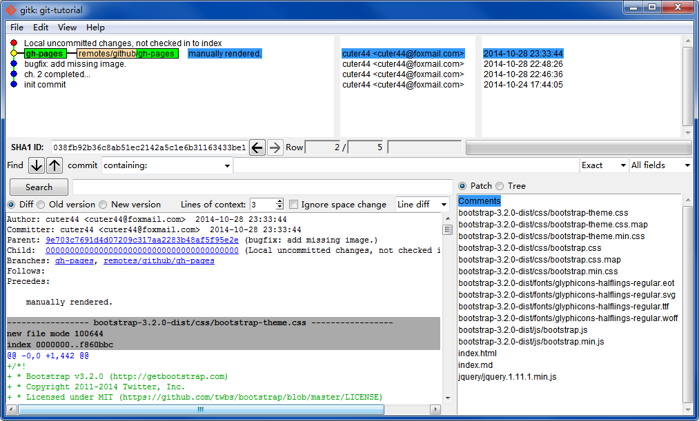
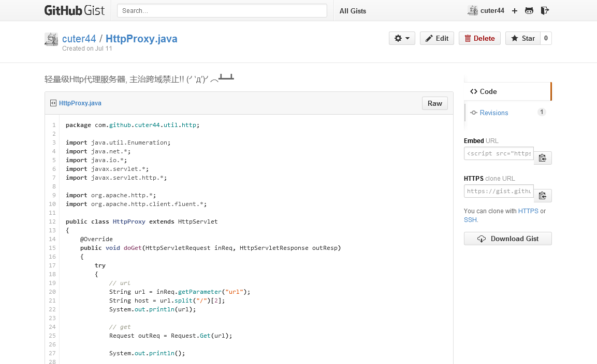

如果你看到这行字, 说明打开的方式不太对. 我们墙裂建议你观看<a href="http://scau-sidc.github.io/git-tutorial/">用 Bootstrap 渲染的页面</a>

<strong>如果你看到这个蓝色的小框框</strong> 那就对了. 大家好我是小框框, 肩负着插入和旁白的职责 (｀･ω･)ノ

# 超科学的git和Github讲座(凡人)

> @author  [cuter44](https://github.com/cuter44)  
> @version 3.0.0-prerelease1+build20141030  
> @license  CC 3.0 BY CN  
> @acknowledge [Github](https://github.com/) & [Github Pages](https://pages.github.com/‎), [SCAU-SIDC](https://github.com/scau-sidc), [GitBook-zh_CN](http://gitbook.liuhui998.com/index.html), [MarkLodato/visual-git-guide](https://github.com/MarkLodato/visual-git-guide), [StackEdit](https://stackedit.io/‎), [MarkdownPad2](http://markdownpad.com/),  [exoticknight](https://github.com/exoticknight),  [FTS](https://github.com/fishtreesugar) 
> @source hosted on [Github:scau-sidc/git-tutorial](https://github.com/scau-sidc/git-tutorial/)    

## 0.

通常来说这个时候应该说下 _git是什么_, 不过为了为了让这篇教程跟国产垃圾教材有所区别, 这里啥都不写有兴趣的话自己翻[维基](http://zh.wikipedia.org/wiki/Git)去. 现在, 只需要将 git 理解成 **一个可以在多人环境下随时保存和合并源代码的工具** 即可.  

还有 Github, Github 就是依托 git 所建立的代码托管平台/社区, 如果非要做个对比的话它有点像 Google Code 和 SourceForge. 你可以在那里四处乱逛, 寻找自己想要的代码, 吐槽别人; 或者直接脑洞大开自己写个软件出来, 搞不好还会受到路过大神的加持...

然后呢, 我们的目标是, 写一个"萌萌哒"的"一个一两个钟能学会, 并且一两个钟之后还想回头看的教程". 在这个教程中我们会以一种实践的态度完成对git的学习, 各位一定要全力地去do哦 ^▽^

比如这个教程就是托管在Github上面的, 如果有幸能接收到<a href="https://github.com/scau-sidc/git-tutorial/issues">小纸条</a>的话我会很开心的~

啊对了这里顺便推荐一个烂片, <i>遇见未来 Next</i> (IMDb:<a href="http://www.imdb.com/title/tt0435705/">tt0435705</a> | <a href="http://movie.douban.com/subject/1793909/">豆瓣↗</a>). 凯奇大叔演的. 据说只有程序猿能看懂, 当中演示了分支推衍和回滚等(蓝星人看了会Σ(°д°|||) 程序猿看了会(.ㅍ_ㅍ)的)烂梗, 而这些基本可以类比于 git 的原理模型. <del>有兴趣</del>实在闲得慌的可以去观赏下.

## 1. 首先, 我们需要一个工具

那当然就是在自机部署一个 git 了.  

### on Linux

一个命令搞掂:  

	apt-get install git

, 或者等价的包管理器指令(yum, pacman 等)

### on Windows
这里是适合普通人的操作步骤:  

作为一个有强烈<del>责任心</del>精神洁癖的软件攻城狮, 我会墙裂推荐从官方软件源获得软件:

http://git-scm.org/

然后按蓝星人的风俗一路 Next 下去, 除了这些点: 

  
建议这么点, 理由是我有精神洁癖   

  
建议这么点, 理由是这样对蓝星人友好  

  
建议这么点, 理由是: 现在除了Microsoft Notepad以外已经没有哪个编辑器不能 handle \r\n 这个问题了, 这样可以避免引入污染.

### on Mac
(征稿)

### ...and Github
这里先说明一点, git是一种对等的分布式仓库系统, i.e. 它不是非要一个服务器端才能互相交流. 它支持多种通信协议 包括 `git://`, `ssh://`, `https://`, 甚至`file:///` 或者 `svn://`. 换句话说, 只要能够读写对应的文件, 任何一台机器/存储设备都可以作为远程仓库, 甚至不必在上面安装 git .

辣么为啥要有 Github 呢? ...这问题谁也说不清楚. 其中一点或许是他实践了开源精神, 将代码作为交流话题, 并使他看得见摸得着, 看到代码推动世界的前进甚至亲手影响世界... <del>起码比刷微博来得有意义.</del>
不对我要说的不是这个!! ≧□≦"

Github 除了有作为 git 的远程仓库, 提供代码可视化, 版本可视化之外, 还集成了问题追踪(Issue), 代码速记(Gist), Pull Request 等有效提升程序猿战斗力的工具. 反正...用过都说好...

废话了这么多总该去注册个 Github 帐号吧? 快去!! → https://github.com/join
然后找到组织→ https://github.com/scau-sidc , 加不进去对吧? 嗯这坑爹的至今都没有站内信功能, 所以只能私下找老邝或者副主任等老油条把你拉进去了. 

<strong>注意</strong> 必须提前做好这一步, 因为下一步实验会用到里面的仓库, 不加进来的话就只能干瞪眼了 (.ㅍ_ㅍ)

英文界面不会撸? 可以去看看 [Github官方的新手教程](https://help.github.com/categories/bootcamp/) (←还是英文的), 或者在本教程关于Github的章节会点到一些.

## 2. 心に刻んだ夢を放て!

标题出自炮姐OP, 题图出自机巧少女, 图片仅供参考.

当然不可能立即就碉堡到这种程度↑咯 (´・ω・｀)  

对于 Windows 来说, 安装的 git 会附带一个 gui , 可以从开始菜单, 文件管理器的上下文菜单 或者 `git gui` 来启动它. 简单起见我们将从这里入手, 对应的命令行指令使用 `行内引用` 标示, 详细的参数请自行 `git help`.

git 是基于命令行的(而且有SDK), 这意味着你可以自己安装甚至开发各种高大上酷炫狂拽屌的 GUI, 比如 <a href="http://git-scm.com/downloads/guis">官方列出的那些</a>. 但本喵在实际使用了几个之后觉得还是原生的那个最诺基亚. 

首先, 请结合自己的使用习惯准备一个目录(比如 `F:\project` )专门放各种 project , 通常我们将它称之为 工作空间(Workspace), 后文我们用 ${ws} 指代这个目录

假如你不是在一个本地仓库中启动 Git GUI 的话他会弹出下面这个框框:  
  
意思很明确, 你要新建(`init`)呢? 还是克隆(`clone`)呢? 还是打开呢?

这里咱们选克隆, 然后填入以下参数:  

	Source Location: https://github.com/scau-sidc/git-tutorial.git  
	Target Location: ${ws}\git-tutorial

假如你是在一个空目录里启动 Git GUI 并准备进行 clone, 它会默认你想要 clone 到这个目录, 于是不显示第二个输入框

完事之后会变成以下的样子(略微会有些不同, 这种细节不用在意 (･ω･｀)っ彡/ ):  
  

红黄绿的很好看对吧? 时间关系我就不画箭头什么的了...  
左上角红色的部分 表示 工作目录(Working Copy), 也就是你以传统方式写代码时(i.e. 不使用 git ), 打开项目文件夹会看到的文件集合. 仅当你新建/修改/删除文件时, 他们会被列出在这里.  
左下角绿色的部分 表示 Index(可以理解成缓存区, 目前没有公认的中文翻译), 是你在缓存改动准备用于提交的地方, 关于<b>提交</b>的概念将在后文详述.  
<abbr title="Working Copy">WC</abbr> 和 Index 中的文件图标是可以点击的(注意我说的是图标= =b). WC 中的文件被点后会进入 Index, 意思是你缓存( `stage` )这个改动; Index 中的文件被点后会进入 WC, 意思是你放弃缓存这个文件的改动( `reset --mixed` );  
  
右上角黄色的部分 表示 差异(diff) 仅在你在点击 WC 或者 Index 中的文件名时(注意我说的是文件名= =b), 这个区域会列出这个文件改动了哪些行.  
右下角是用来写 <b>提交说明</b> 这个也在后文讲.  

## 3. 摩擦! 摩擦!!

嗯...总之选择 菜单栏 的 `版本库(repository)` > `图示所有分支的历史(Visualize all barnches history)`, 然后会弹出一个新的窗口. 这货叫做 gitk , 大概长得像下面的样子: 

  

界面上方由线和点组成的部分称为`版本树`, (默认会)按时间顺序倒序排列. 现在看到的是一条直线, 但随着项目的多人合作这个它会逐渐产生分叉和合并. 这条线上的每一个小圆点表示一个 `提交(commit)`, 各种小圆点/小标签都有不同的含义:

* 红色的小圆点 ● 是当前 工作目录(WC) 发生的变更, 仅在修改/删除过内容时出现.
* 绿色的小圆点 ● 表示缓存区的变更, 仅在缓存区非空时出现, 且出现在红点和黄点之间.
* 黄色的小圆点 ●  表示 `HEAD`, 也就是当前所处的提交点, 或者说(打游戏时)目前读出的存档点.
* 蓝色的小圆点 ● 是已经存入数据库的提交, 所有蓝色点的集合称之为 `History`, 这些点是不能修改的
* 至于点与点之间的线就不用我解释了吧 →_→

而你写的代码或者别的什么东西就是经过 红点→绿点→<蓝点 这个过程逐步进化成整个版本树的.  
每个提交都有一个唯一的 `SHA1 ID`, 这个值是通过提交内容等一堆因子算出来的, 理论上全球唯一.

* 还有 绿色的小标签 表示 `分支(branch)` , 其中有些带有 嫩肉色前缀 的表示 `远程分支(remote branch)`. 两者的区别是前者是由你建立和管理的, 可以随便操作, 后者是别人建立和管理的, 对远程分支的操作需要经过分支主人的同意.  
* 绿色的部分相同的分支互为`跟踪分支(tracking branch)`, 意指他们是同一个分支在不同仓库的映像, 跟踪分支只有在相容(其中一个为另一个的子集)的前提下进行 push 操作(后面我们就解释这一条)  
* 成熟的项目还会有 黄色的小标签, 它叫做 `tag` 或者 `里程碑(milestone)`, 通常会写着类似 1.0.0 的版本号, 这是给大牛发行用的, 小朋友没事不要玩这种危险的东西. (‾w‾ )  

那么这个版本树的存在意义是什么呢? 首先请将它想象成一个 有向无环图 (数据结构学得不好的同学请想象成 有向链表 ‾ω‾b ). 那么每一个 ● 提交 都是这个图的节点. 而每一个 分支/tag 可以想象成指向这个节点的指针/引用. 通过将指针随便乱指(大误), 你可以读出任意一个节点的完整代码然后加以修改. 这就跟打游戏时的S/L大法一样bug. (｡・ω´・)っ  
不过呢, 如果只是用版本树来开挂那也太low逼了(因为现在随便一个现代编辑器都有按时备份的功能). gitk或者说版本树本身还提供额外的信息, 比如说...看到提交记录里的邮件地址和时间了吗? 合作编程时被人捣乱? No problem! 除了能用 git 回滚之外你还能通过提交记录找到凶手然后冲过去揪住那人的衫领打他个半死...

虽然现实很残酷, 不过, 看不懂版本树的人...会被同伴像垃(le)圾(se)一样抛弃的哦~

那么版本树存在哪儿呢? 打开 `${ws}\git-tutorial\.git` , 这是一个隐藏文件夹, 下面还有n个子文件夹, 四处打开看看? 切记不要乱删东西啊.. 

## 4. 挖掘! 挖掘!!
呃...我们还是来做实验吧! ヾ(*ΦωΦ)ﾉ︵◇  

首先我必需假定你们已经完成上述步骤了, 没完成的按前文 HINT 真的就只能干瞪眼.  
实验内容依然是毫无新意的订外卖...假定我们现在要订外卖, 以前我们会找一个人负责拿着纸笔逐个收集订单. 但这样很累, 而且很容易数多或是数漏. 所以我们这次要用 git 来收集订单, 然后自动向外卖店下订.

<strong>我们只是模拟订外卖而已</strong>, 事实上不会有餐点送到, 请勿抱有任何期待.
 

### 提交(commit)

1. git gui 打开前文拷贝回来的仓库.
2. `分支(branch)` > `新建(create...)` > (名字里面随便输点什么, 我建议用你们的Github id, 这样可以避免重复, 其余默认即可). > 新建
3. `版本库(repository)` > `Explorer Working Copy` > (打开了文件浏览器, 显示的是这个项目的根目录) > 打开 experiment 文件夹
4. 随便挑个你喜欢的餐馆菜单, 打开, 点个餐然后保存.
5. 回到 git GUI > `重新扫描(Rescan)` > (看到 WC 里有个很醒目的列表项?) > 将它缓存到 Index > 点 `提交(commit)` > (弹框!! 要先写提交记录才能提交!!)
6. 焦点到右下方的`提交描述(Commit Message)` > 写点什么, 比如 `${自己的名字}点了${餐点的名字}` > 再次点 `提交(commit)` > (弹框!! 你是谁!?)
7. `编辑(edit)` > `选项(option)` > (弹一个大框出来) > `用户名(User Name)` `Email Address` 理论上可以随便填, 但现在请填写你在Github的id和email.  > `保存` 
   
细心的小伙伴会发现... Σ(ﾟДﾟ；≡；ﾟдﾟ)咦怎么有两列!? 区别是左边的(仓库配置)仅作用于当前仓库, 右边的(全局配置)作用于所有仓库, 仓库配置高于全局配置.

8. 再点 `提交(commit)` > (终于交上去了...)
9. 打开 gitk 看看版本树变成怎样了?

有没有一种<del>荡气回肠</del>傲娇的感觉? 事实上诸如 代码要留名 提交有理由 都是良好的软件工程实践, git 以一种还算友好的方式督导你完成这些工作, 习惯了就好.

虽然现实很残酷, 不过, 不好好写提交记录的人...会被同伴像垃(le)圾(se)一样抛弃的哦~

分步解释:

1. Step 1 不解释
2. Step 2 <strong>创建分支</strong>
  * 先来解释下分支的意义: 你可以将分支理解成代码界的平行世界, 每个独立的分支等于一个独立的环境, 里面含有分支前的代码的镜像. 这个分支会呈线性向前发展, 而(在与其它分支合并前)不受到其他分支的干扰, 也不会干扰到别的分支. 
  * 所以为什么要新建分支呢? 因为这会破坏分支内部的线性有序性(写后读读后写写后写读读写写写写读读...)怎么样光是断句就很头痛吧? 旧一代的版本管理工具比如svn就是因为没有原生支持分支所以才没朋友的.  
3. Step 3
4. ...和 Step 4 模拟了实际工作时对代码的<strong>修改</strong>
5. Step 5 (试图)将变更沿着 WC → Index → commit <strong>缓存</strong>, 就如我们在前文提及的那样.
   在写代码的过程中可以进行多次的 WC → Index, 在提交之前, 多个 Index 会以幂等的方式合并, 不过这在大多数情况下没什么意义...
   注意仔细甄别要提交的内容, 有些会对强迫症患者造成伤害的东西(参见下面的红色框框)是不能交上去的. 这里介绍两种一劳永逸的方法: [.gitignore 和 excludes](http://gitbook.liuhui998.com/4_1.html)
   
git 不会自动地/定时地提交更改, 你自己也不要试图实现这种功能. 因为版本库都有"提交了就删不掉"的特性, 所以例如写到一半根本过不了编译的源代码啊, 程序运行日志啊, 编译时产生的中间文件啊, 连接数据库的帐号和密码啊, 果照啊(喂!), 小电影啊(喂喂!!)之类的东西要是一不小心提交上去的话...会死人的...

   
"提交了就删不掉"特性在 git 身上并没完全反映, 一个commit在 (没有被任何branch指向) 且 (没有其他commit依赖它) 时可以被垃圾回收掉. 不过, 假如你的果照已经被别人clone到自己的机器上...那就神仙都救不了了...

6. Step 6 <strong>提交描述</strong> 是一个很重要的东西, 良好的提交记录可以向你的队友介绍你为项目作出的新贡献(而无需强迫他去阅读你的源代码). 一个比较合理的提交描述大概要写成[这样](https://github.com/cuter44/alipay-sdk/commit/02e9680934cde2d930e2a789c04ce9bf024487c5#js-repo-pjax-container), 当然你也可以用中文写, 也可以制定在自己工作组内通行的标准, 只要能起到概括/秒懂的效果就行.
7. Step 7 不解释, 因为这不是日常.
8. Step 8 <strong>提交</strong> 会提交到你的 <strong>本地版本库</strong> 的 <strong>当前分支</strong> 上, 通常都不会出什么意外.
9. Step 9 看着分支树一天天长大是不是很有成就感?

### 合并(merge)

在上面的最后一步时你看到的分支树大概会像这个样子:  
  
可能会有分叉, 可能会没有, 但总之以你名字命名的分支和`gh-pages`分支已经不在同一个提交上了.

1. Git GUI > `分支(branch)` > `Checkout` > `本地分支(Local branch)` > `gh-pages`
   
这里再顺带一提 `检出(checkout)` 指令, 他允许你读取任意branch/commit的内容, 大致相当于游戏的 Load. 本来在上一节新建分支的下一步是要进行一次checkout操作以切换分支的, 但新建时下面有个默认勾选的`在创建后Checkout`, 所以 git 就自动切换分支了.

2. (界面回到 Git GUI) > `合并(merge)` > `本地合并(Local Merge)` > 选择你自己的分支 > `merge`

在这个教程的情景中, 这个操作应该会顺利完成. 之后你的版本树看起来大概会像这样:  
  
可能会出现两条线, 也可能不会, 这取决于具体情境.

### 上传(push)

到目前为止, 这些改动都是在你本地完成的, 表示服务器端的仓库的 remotes/origin 还停留在比较早的阶段. git 用于将本地更新发往远程仓库的操作名为 `上传(push)`.  

作为一个<del>死理性派</del>强迫症, 本喵翻遍字典都没找到将push解释成上传的义项. 不过 git 官方的 i18n 这么译, 也就只好这样了...
 

1. Git GUI > `远端(remote)` > `上传(push)` > 选择 `gh-pages` > `上传(push)`
2. 然后会弹框, 报告操作进度, 可能会要求你输入你在 Github 的帐号和密码.
   
也可以让 git 记住密码, <a href="http://www.gnu.org/software/inetutils/manual/html_node/The-_002enetrc-File.html">https下使用.netrc</a>, <a href="http://git-scm.com/book/zh/v1/服务器上的-Git-生成-SSH-公钥">ssh下使用ssh公钥登录</a>

好了麻烦的时候来了. 之前提到过只有相容的跟踪分支可以互相推送, 然后在上面这种错误示范下...是肯定会出问题的. 除了第一个 push 的童鞋之外的 push 都会被阻止.

### 冲突(conflict)和解决冲突

在上一节 上传(push) 中, 大部分同学会看到下面这个框框:
  
大体意思是有人先于你上传, 因为违反相容性所以不能接受你的上传, 后面还给出了说明, 让你先合并服务器端的更新再次提交. 

1. 使用 `commit` 或者 `stash`(将在进阶篇讲授) 保存你当前的 WC.
   
这步切记要仔细完成. 尤其要注意提交尚未纳入版本管理的文件, 如果别人的提交中有同名文件, 属于你的那个可能会被覆盖掉! (×﹏×") 
  
2. 切换到本来要提交的分支, 在当前上下文是 gh-pages.
3. 然后在下列等价操作中任选其一:
   * `远端(remote)` > `从...获取(fetch from)` > `origin`, `合并(merge)` > `本地合并` > (自动选择了`跟踪分支(Tracking Branch)` 的 `origin/gh-pages`) > `合并(merge)`
   * (这个只能命令行做) 

            git pull origin gh-pages

4. 然后会继续弹出红色的框:
   
   大意是以下文件冲突, 请手动合并.
5. 回到 Git GUI, 大概显示为以下样子:
   
   左侧用特殊的图标显示出有冲突的文件, 点击它之后会显示出冲突详情, 重点是这里:

           <<<<<<< HEAD
          + 
          +5+0    醇香咖啡                   ¥8
           =======
         + 
         + kuangyj    焦糖拿铁                   ¥10
           >>>>>>> github/gh-pages
   这是 git 用于标记冲突的语法, 七个左尖括号到七个等号之间是当前分支的内容, 七个等号到七个右尖括号之间是待合并分支的内容.
6. 然后, `工具(Tools)` > `edit this file` 打开这个文件编辑. 因为我们正在"订外卖", 所以两条都要保留下来, 最后变成这样:
   
        (空行) 
        5+0    醇香咖啡                   ¥8
        kuangyj    焦糖拿铁                   ¥10

   
是不是找不到`edit this file`呢? 因为这是副主任自己配置的wwwwwww

7. 保存之后回到 Git GUI `重新扫描(Rescan)`, 修改内容已经反映到diff上了, 这时可以将 WC 的修改 `stage` 然后 `commit`.
8. 再次尝试 `上传(Push)`
   
如果再次上传还是冲突...那只能怪自己手脚慢了(因为别人比你先解决冲突然后把自己的版本覆盖上去了)

除了上述方法以外, 如果你确定要覆盖服务器的分支, 可以在 push 时选择 force overwrite. 该选项会强制将远端的对应分支重置为本机上的样子, 相应的远端分支原来的内容会丢失. 慎用...

以上几乎就是 一个凡人级别的程序猿/媛 日常使用git 所会碰到的全部问题了. git的命令[还有很多](http://git-scm.com/docs), 某些指令例如 `git log`, `git status`, `git branch` 已经隐含在图形界面操作之中; `git rm`, `git mv` 等因为很少用到所以略过; `git stash` `git rebase` 等将在进阶教程(还没写出来)内讲述, 当然也可以独自阅读 reference 和 [Pro Git](http://git-scm.com/book/zh/v1) 学习.

## 5. Build software better, together.

嗯, Github 的口号...
很难定义 Github 是什么, 他不是单纯的软件仓库, 不是社交网络, 不是协作工具, 虽然它样样都占点边.
围绕 git 的版本管理功能, 它扩展了很多好玩的功能, 使写代码变成一件相当有趣的事.(蓝星人就知道刷微博...唉)

好吧正题...

### Timeline & Dashboard
登录之后的第一个画面就是 Timeline, 不过通常都没啥好看的, 因为大部分信息都没有价值.

随便戳一个人的名字会去到他的个人主页(比如[副主任的](https://github.com/cuter44))左边是 biography, 自己在 settings 填写. 右侧分了好几块, 从上到下分别是:
 
* 页签 切换 活动数据, 仓库列表, (那个用户的)timeline , 后两个不解释了.
* 热门仓库 显示这个用户写的热门内容.
* 贡献 显示活跃度, 某些人会喜欢把那个列表刷到全绿... 不过如果[参拜过 Linus 大神的 Github 帐号](https://github.com/torvalds), 呵呵.
* 然后戳上面的小格子下面会列出具体的内容.

哦对了, 访问别人的主页时右上角会有 <button class="btn btn-success">Follow</button> 按钮, 不解释. 

### Repository
当遇见喜欢的 repo, 比如[这篇教程](https://github.com/scau-sidc/git-tutorial), 可以使用右上角有三个操作 <button class="btn btn-default">Φ Watch</button><button class="btn btn-default">★ Star</button><button class="btn btn-default">Υ Fork</button>. 它们大致对应于蓝星微博的 收藏 点赞 转发 操作, 更详细的含义请自行在[Github的帮助系统](https://help.github.com/)搜索.
旁边的数字表示 Watch/Star/Fork 这个仓库的人数, 戳进去可以看具体是谁.

### Issues

每个仓库都会附带一个轻量级的跟踪系统, 可以用于 你发现bug并且想报告给作者/向作者提问提建议/请求队友协助(比如要求新的API)/记录自己的待办事项, 用法和 teamibition 的任务版大同小异, 这里就不再展开说了.

### Wiki

如果作者愿意, 会开放并且撰写 Wiki. Wiki 通常用于弥补文档注释的不足, 用来放置用户文档或者系统文档. 不过就实际使用情况来说, 其实不是那么方便...

并且...像副主任这种乐于写文档的业界良心已经不多了...

### Pull Request

前面我们教了上传(push), 能使用 push 的前提条件是你对远程仓库有写权限. 举个栗子, 刚刚我们用于订外卖的仓库, 只所以强调要提前加入组织就是为了授予对仓库的写权限. 如果没有写权限而又想要往仓库推送内容的话, 就应该使用 Pull Request 操作.

<abbr title="Pull Request">PR</abbr> 是 Github 特有的操作.

1. 首先要将自己的分支(在这里是`galin`)上传到 Github.
2. 然后登入到项目, 会看到下图的提示, 果断点<button class="btn btn-success">Compare &amp; pull request</button>.
   
3. 然后接下来的操作与 commit 类似, 它要求你给出这个 PR 的提交描述, 所以应该按提交描述的规范认真写, 完成之后按 <button class="btn btn-success">Create pull request</button>.  
4. (跳转到PR详情页面), 整个页面包含了 你写的 PR 摘要, 包含的 commit, 文件的diff

然后仓库的主人和这个 PR 的责任者会收到邮件. 然后他会检查你的 PR, 从而选择接受或者拒绝你的提交. 到这里 PR 就完成了, 界面看上去会变成题图的样子.

PR 的应用场景包括但不限于以下几种:  

* 从仓库外(别人fork你的)接受提交
* 同一个工作组中, 有一个大牛做负责人, 大牛规定所有代码要由他过目才能汇集到主分支.
* 自己给自己发 PR(当备忘使用)

### Github Pages
就是你正在看这篇教程所依赖的托管服务了, 它会将当前目录的 `gh-pages` 发布成静态网站. 并且支持一种名为 [jekyll](http://jekyllrb.com/) 的脚本语言. 嗯...然后, 你懂的.  Where there is an API, there is a way.
比如[本工作室的博客](http://scau-sidc.github.io/)就是几只大牛<del>利用业余时间</del>受老邝所迫撸出来的.

### Gist

经常会有一些小脚本你想抄起来以后用, 但它本身的规模又没大到需要专门建个仓库去安置它.  
Gist就是用来满足这种需求的. 随手写, 随时用, 闲得慌了还能"手气不错"一下.

## 6. 某超科学的<del>附录</del>黑历史

### 超科学的提交描述文法

最开始工作室开荒的时候, 大家都不是很懂, 于是提交描述各种乱来...

    整合

↑ 整合了啥没说, 还是要翻代码

有时还会看到些嘲讽向的:

    没修改什么

没修改什么你交个毛线!! (＃°д°)

于是乎, 久病成良医, 慢慢地琢磨出一套标准:  

    登录/激活功能追加完成
    
    + Web API, 详情请参见javadoc
      + /authorize/register
        ! 现在还不能发邮件, 但是会通过json返回激活之必要参数
      + /authorize/activate
      * /authorize/login
        + 追加了样例
      * /authorize/logout
        + 追加了样例
      * /authorize/getRsaKey
    + 追加Criteria机能, 详请参考wiki:Criteria
    + 追加了用于RSA加密的实用工具, 详请参考wiki:服务器部署指南

提交的标题不说了, 很容易就能总结出来.
然后下面以树状的方式列出更新的内容. 前导的符号表示更新的类型, `+` 表示新增, `*` 表示修改, `-` 表示删除, 这些和 `git diff` 的表示法相容. 需要额外注意的内容则用 `!` 表示.

### 超科学的分支命名法
有一些约定俗成的命名规则:

* 如果你的仓库是以 `git clone` 拷贝回来的, 那么源仓库会被命名为 origin, 也就是 本源 的意思, 在命令行执行 `git fetch` `git push` 且没有指定远程仓库的名字时, 会默认使用这个.
* 主分支通常命名为 `master`, 用于存放用于发布的稳定版本. 且作为[软件基线](http://baike.baidu.com/view/2113289.htm)(发布基线).
* 通常会有一个开发分支 `develop`, 用于收集和积淀开发过程中的功能性更新, 且作为软件基线(开发基线). 通常这两个基线的每一个提交都要求是完备的, i.e. 能够正确编译且通过全部测试用例(不过工作室一直以来都没测试管理, 所以说了也白说...).
* 然后...没了, 更规范的实践推荐看这个<a href="http://nvie.com/posts/a-successful-git-branching-model/"><i>A successful Git branching model</i></a> By <i>Vincent Driessen</i> (<a href="http://segmentfault.com/a/1190000000434973"><i>git分支最佳实践</i></a> 由 SegmentFault 翻译)   

--------------

后记

妈蛋这又不是轻小说写毛线后记(╯‵д′)╯︵┻━┻
进阶版再说吧...

