<link rel="stylesheet" href="./bootstrap-3.2.0-dist/css/bootstrap.min.css">

# 超科学的 git 和 Github 讲座(その１)

> @authors [github://scau-sidc/git-tutorial/contributors](https://github.com/scau-sidc/git-tutorial/graphs/contributors)  
> @version 4.0.0-build20151215  
> @license  CC 3.0 BY CN  
> @source [github://scau-sidc/git-tutorial](https://github.com/scau-sidc/git-tutorial/)    

> Archives
> * Ver. 2014 - [./index-archive-20141212.md](./index-archive-20141212.md)

## 0. What is ...
通常来说这个时候应该说下 _git是什么_, 但为了 dismystification , 这里不会展开. 有兴趣的同学请自行[维基 ↗](http://zh.wikipedia.org/wiki/Git).   
现在, 只需要将 git 理解成 **一个可以在多人环境下随时保存和合并源代码的工具** 即可.  

Github 就是依托 git 所建立的代码托管平台/社区, 你可以在那里四处乱逛, 寻找自己想要的代码, 吐槽别人; 或者直接脑洞大开自己写个软件出来, 搞不好还会受到路过大神的加持.
不过对于英语成绩不好的同学来说, Github 是个噩梦. 在本篇教程中将只涉及 Github 的仓库托管功能. 因此只需要知道 `Sign up`, `Sign in`, `Create Repository` 这几个词组的中文意思即可.
提供类 Github 服务的供应商还有很多, 比如 [OSChina Git ↗](https://git.oschina.net)(简中/EN), [GitCafe ↗](https://gitcafe.com/)(简中/繁中/EN), [bitbucket ↗](http://bitbucket.org/)(EN). 但在此我们建议使用 Github, 一个充分理由是 git 的作者 [Linus Torvalds 使用 Github ↗](https://github.com/torvalds).  

千万不要问 <i>Linus Torvalds 是什么</i> , 老邝保证不打死你.

这里顺便推荐一部影片, <i>遇见未来 Next</i> (IMDb:<a href="http://www.imdb.com/title/tt0435705/">tt0435705</a> | <a href="http://movie.douban.com/subject/1793909/">豆瓣↗</a>). 凯奇大叔演的. 主角具有对剧情分支的并行推衍能力, 通过分支和剪枝避免自己领便当, 其工作原理和 git 类似. 可以作为本教程的参考.

## 1. 首先, 我们需要一个工具

那当然就是在自机部署一个 git 了.  

### on Linux

一个命令搞掂:  

	apt-get install git

, 或者等价的包管理器指令(yum, pacman 等)
, 或者通过源码编译安装(此处省略1000字)

### on Windows

对于蓝星人来说通常如下展开:  

http://git-scm.org/

然后按蓝星人的风俗一路 Next 下去, 但副主任建议如下的加点方式: 

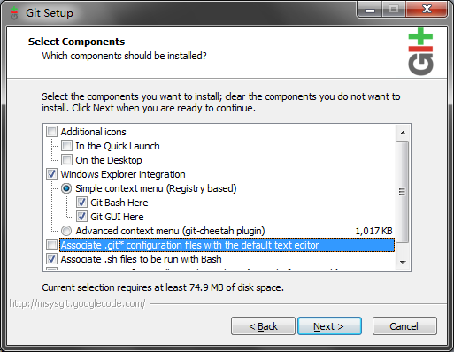  

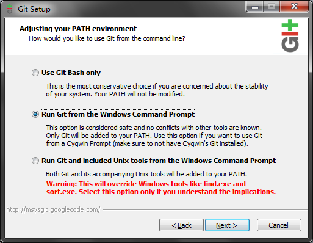  

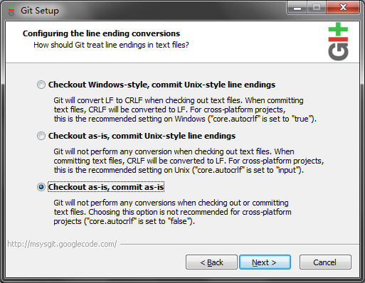

理由是...为了能更方便地集成到win, 以及在跨平台间兼容.  

### on Mac
(这个请去请教部长)

### as of Github

再重复一次, 在本教程中只使用 Github 的仓库托管功能. Github 的其余黑科技将在附录部分解说.

什么是仓库托管呢? 举个栗子,

在使用 git 之前你们写的代码都存在自己的硬盘里:
老师: (夺命追魂call)"你程序写好了? 拿来我看看"
你: "哦"(找U盘, 复制粘贴, 千里迢迢呈送老师台启)
(翌日)
老师: (夺命追魂call)"同志快醒醒你还有几行代码有bug没改"
你: "哦"(翻箱倒柜找另一个U盘, 复制粘贴, 千里迢迢呈送老师台启)
(Repeat)

通过仓库托管将项目/代码放置在 Github 后:
老师: (夺命追魂call)"你程序写好了? 拿来我看看"
你: "https://github.com/foo/bar"
老师: "..."
(翌日)
老师: (夺命追魂call)"同志快醒醒你还有几行代码有bug没改"
你: "哦"(更改, 提交, 上传)"改完了. 昨天那个地址."
老师: "Good..."

比如本教程的源代码托管在 <a href="https://github.com/scau-sidc/git-tutorial">https://github.com/scau-sidc/git-tutorial</a> . 任何人都可以自助取得.

之后的实验需要用到 Github, <strong>请务必注册一个账号</strong>.

 <a href="https://github.com/scau-sidc">github://scau-sidc</a> 是 935 驻 Github 的开发者组织, 里面有很多老鬼在划水. 可以在注册完后将你的 id 发给老邝要求加入.

[Github官方的新手教程 ↗](https://help.github.com/categories/bootcamp/)

## 2. 心に刻んだ夢を放て!

标题出自炮姐OP <a href="http://www.xiami.com/lrc/1769196206">↗</a>, 题图出自机巧少女, 图片仅供参考.

当然不可能立即就碉堡到这种程度↑咯 (´・ω・｀)  

对于 Windows 来说, 安装 msys-git 会附赠一个 gui , 可以通过开始菜单/文件管理器的上下文菜单/`git gui` 指令来启动它.

但其实老鬼们都直接用命令行, 为了能和谐装逼我们会在行文中标注对应的指令.

你可以通过其它第三方图形界面使用 git, 比如 <a href="http://git-scm.com/downloads/guis">官方列出的这些</a>. 但副主任在实际试用后觉得还是附赠的那个最诺基亚. 

在 Android 上也有可用的 git 工具, 但至今为止未发现哪个特别好用的. iOS 方面请咨询部长.

总之我们已经启动 git 了, 大多数情况下会弹出下面这个东东:  
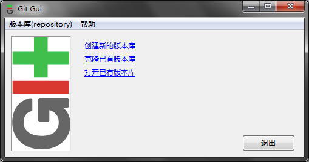  
意思很明确, 你要新建(`init`)呢? 还是克隆(`clone`)呢? 还是打开呢?

今年我们选 `创建新的版本库`, 在随后的对话框中挑选一个你喜欢的位置来置放你的代码. 这里以 `F:/project/hello-world/` 为例.

完成后会变成以下的样子:  
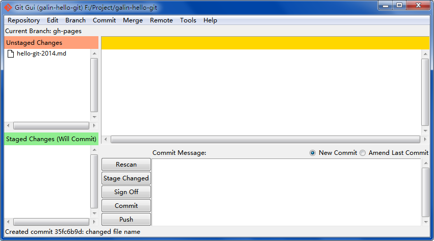

图文稍微有点不一样, 请不要在意这些细节 (･ω･｀)っ彡/ 

  

解说:  
左上角红色的部分 表示 工作目录(Working Copy), 也就是你以传统方式写代码时(i.e. 不使用 git ), 打开项目文件夹时看到的文件集合. 仅当你新建/修改/删除文件时, 他们会被列出在这里.  
左下角绿色的部分 表示 Index(或称为 缓存区, 目前没有公认的中文翻译), 是你在缓存改动准备用于提交的地方, 关于<b>提交</b>的概念将在后文详述.  
<abbr title="Working Copy">WC</abbr> 和 Index 中的文件图标是可以点击的(注意我说的是图标= =b). WC 中的文件被点后会进入 Index, 表示需要缓存( `stage` )这个改动; Index 中的文件被点后会进入 WC, 表示放弃缓存这个文件的改动( `reset --mixed` );  
右上角黄色的部分 表示 差异(diff) 仅在你在点击 WC 或者 Index 中的文件名时(注意我说的是文件名= =b), 这个区域会列出这个文件改动了哪些地方.
  
右下角用来写 <b>提交说明</b> 这个也在后文讲.  

## 3. 种一棵树最好的时间是十年前, 其次是现在

标题取自最近在知乎流行的名言, 鸡汤请小心有毒.

选择 菜单栏 的 `版本库(repository)` > `图示所有分支的历史(Visualize all barnches history)`, 会调用另外一个程序. 这货叫做 gitk , 大概长得像下面的样子: 

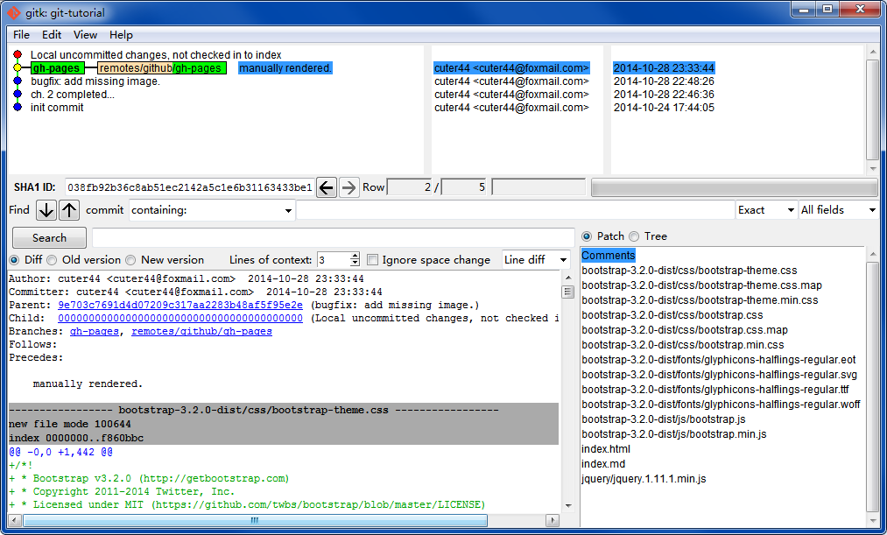  

你打开的那个无意外只有一个绿点, 随着你的热情与爱它会慢慢成长的. 在此之前请先看这张图↑就好.

界面上方由线和点组成的部分称为`版本树(History)`, 按各次提交的逻辑顺序倒序排列. 这条线上的每一个小圆点表示一个 `提交(commit)`, 各种小圆点/小标签都有不同的含义:

* 红色的小圆点 ● 是当前 工作目录(WC) 发生的变更, 仅在修改/删除内容而未缓存时出现.
* 绿色的小圆点 ● 表示缓存区的变更, 仅在缓存区非空时出现.(截图时没有这个怪我咯)
* 黄色的小圆点 ●  表示 `HEAD`, 是仓库当前的状态, 通俗来说就是(打游戏时)目前读出的存档点.
* 蓝色的小圆点 ● 是已经存入仓库的提交, 这些点是不能修改的
* 至于点与点之间的线就不解释了 →_→

每个点相当于(游戏的)一个存档, 可以从任何一个点读档然后任意地展开. 所有蓝点原则上无法改动, 亦无法单独地删除.

因此, 请不要将无法编译的源代码/编译过程中产生的中间文件/特定于编辑器的配置文件/日志/密码/果照/爱情动作片等放到版本库中.

* 还有 绿色的小标签 表示 `分支(branch)` , 其中有些带有 嫩肉色前缀 的表示 `远程分支(remote branch)`. 前者是存在于此仓库的分支, 后者是存在于别的仓库的分支  
* 成熟的项目还会有 黄色的小标签, 它叫做 `tag` 或者 `里程碑(milestone)`, 通常会写着类似 1.0.0 的版本号, 这是给大牛发行用的.
  
Tag 什么的当然是起到 tag 的功能啦.(废话

### So what?

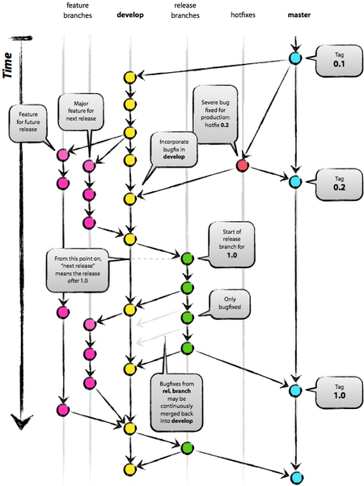

Credit by <a href="http://nvie.com/about/">Vincent Driessen ↗</a>, originate from <a href="http://nvie.com/posts/a-successful-git-branching-model/">http://nvie.com/posts/a-successful-git-branching-model/ ↗</a>

版本树的存在意义在于, 你可以创造无数平行的小宇宙↑. 这些小宇宙有相对独立的时间线, 但相互之间可以相互干涉或者融合.
版本树的每一个 ● 提交 都是独立的状态(类比成游戏的存档), 于是你可以从任一个节点读档然后继续展开. 还有一个和游戏存档类似的特性是它们可以被分发, 在其他的机器上完全地再现.
而 分支 和 Tag 则起到命名标记的作用, 方便人类以视觉快速地找到某些特别的提交. 两者的区别是分支<i>通常</i>会随着提交和合并而自动演进, 而 Tag 则是完全静态的.

git 具有自动垃圾回收的功能, 分支和 tag 某种意义上起着 钉子 的作用. 版本树中, 没有被钉住的叶子节点会因为 unreferenced 而被销毁. 

不过在这篇教程的范围内是不会涉及这种进阶操作的啦 ฅ(・ω・ฅ)

版本树实际存储在项目文件夹之中, 一个名为 `.git` 的隐藏文件夹里. 如果不小心删掉的话所有历史记录都将会消失.

随着项目的扩增, 版本树会长得...很好看. 比如工作室贡献翻译的 [vim-cheat-sheet ↗](https://github.com/scau-sidc/vim-cheat-sheet/network) 或者工作室开发的 [wxpay-sdk ↗](https://github.com/cuter44/wxpay-sdk/network)

## 4. 君が歌えば 僕も歌うから

标题出自银之钥OP <a href="http://www.xiami.com/lrc/1772506559">↗</a>.

接下来我们做的实验, 分组的.  
大概 2-3 人一组, 如果你正在独自观看这篇教程, 这意味着你需要至少找一个小伙伴或者以一人分饰两角.  
堂授课请使用 手心手背分组法 或者 抛硬币分组法 快速分为2-3人的小组.   

遵循传统以下将使用 <a href="https://en.wikipedia.org/wiki/Alice_and_Bob">Alice, Bob and Carol</a> 作为角色代名. 请自行设定 cast.

### 实验准备

1. 首先, 互相交换 Github ID, 写在纸上就最好了.  
2. (在上一章中你们应该都已经新建了名为 hello-world 的本地仓库了)
3. Alice 登入 Github, 点击右上角的  → `New Repository`. 创建远程仓库.
4. `Repository name` 你们喜欢就好. (这里以 <i>hello-world</i> 为例)
5. 创建之后会在中间醒目的位置提示类似于 https://github.com/cuter44/hello-world.git 的 URL, 复制它.
6. Alice, Bob 和 Carol 打开自己的 git-gui, 菜单栏 → 远端(Remote) → Add
7. `Name` 填写 <i>origin</i>, `Location` 使用之前复制的值. 确定.
   
这样你们相互之间已经确定同一个同步关系了.

   
对于既存的仓库还可以用 `克隆(clone)`, 相当于在(在本地创建仓库, 设定 origin 为源仓库地址, 复制源仓库内容)的命令集合.

8. Alice 在 Github 打开自己的仓库, 选择  Settings → `Collaborators`, 将 Bob 和 Carol 的账号加入到列表中
   
这样 Bob 和 Carol 就具有 hello-world 的写权限了.

9. 另外还有一项必要但与主题关系不大的工作: 三个人各自在 git-gui 打开 `编辑(Edit)` → `选项(Options)`, 在最上面两栏填写自己的 `用户名(User name)` 和 `邮件地址(Email Address)`. 不必要填写与 Github 一致. git 利用这两个字段标识代码的作者, 便于项目的参与者相互之间取得联系.
    
 
### 提交(commit)

现在可以开始写代码了.

之前我们说过以 `F:/project/hello-world/` 为例.

1. Alice 打开项目的根目录 `F:/project/hello-world/`
2. 写 hello world, 比如:

		// hellow.c
	
		#include<stdio.h>
		
		int main(int argc, char *argv[])
		{
			printf("hello world");
			return(0);
		}

3. 保存, 最好顺便编译一次看写对了没有.
4. 打开 git-gui, 文件 `hellow.c` 会出现在左上角 `未缓存的改动(Unstaged Changes)` 区域里, 表示 git 检测到你的改动了. 如果没看到, 点击下方的 `重新扫描(Rescan)`, 要求 git 检查改动.
5. 点击 `hellow.c` 的图标, 它会转移到左下方的 `已缓存改动(Staged Changes)`  里.
6. 逐一检查及筛选将要提交的文件, 重复以上步骤添加到 已缓存改动 中. 在这个例子里我们只有一个文件需要提交.
7. 在下方的文本框撰写提交说明, 提交说明是用于描述此次提交对整个项目的影响, 便于其他人(也包括将来的你自己)快速地进行检索. 推荐的格式将在附录中讲述, 现在先这样填写:

		inital commit.

   
恭喜你们当中的一部分已经拿下本工作室的成就(之一), First Blood:取得某个项目的 inital commit

8. 现在可以点 `提交(commit)` 了
   
至此 hellow.c 就已经进入 <strong>Alice 的本地仓库</strong>了. 不信的话可以打开 gitk 确认.

9. 在你认为你的工作成果需要共享给别人的时候, 点 `上传(push)`. 
   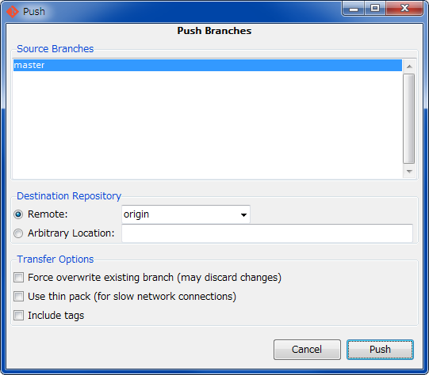
   选择 上传哪个分支(这里选 <i>master</i>), 传到哪个仓库(这里选 <i>origin</i>), 之后你们会玩的了...
   
然后更改被传送到 Github. 可以通过 Github 网页端查看, 或者(被其他人)通过 git 客户端 `提取(fetch)` 到本地仓库.

   
好了也差不多该告诉你们这个事实了.
   这里 origin 是对远程仓库的命名, 可以随便命名所以你想叫它做金鱼草或者猫好好都是可以的. 不同的机器上对同一个远程仓库取不同的名字也是可以的.
   不过名为 origin 的远程仓库被 git 认为是"源仓库", 对于 `push` `fetch` 等远程交换类指令在不指定目标仓库时会缺省将 origin 作为目标.
   

为了避免如历史上的某人<!-- 我不会说是部长 -->一样产生错误的认知, 这里有必要再强调一次:
 
除非你亲自执行相应的指令, git 不会:
<ul>
  <li> 每 5 秒检查一次你写的代码并自动备份;
  <li> 在你按下 <kbd>^S</kbd> <kbd>:w</kbd> whatever else... 的时候自动缓存改动或者提交;
  <li> 自动将更改发到 Github 或者任何其他远程版本库中;
  <li> 在 `提取(fetch)` 操作后自动对你正在编辑的代码打补丁.
</ul>

  

### 提取(fetch), 分支(branch), 以及合作编辑

1. Bob 启动 git-gui, 选择 `远端(Remote)` → `从...提取(Fetch from)` → `origin`
2. (等待 git 从 Github 取得 Alice 的更新)
   
至此已经从 Github 取得 Alice 的更改, 并保存在 origin/master 上. 打开 gitk 可以看到相应的变化.

3. 选择 `分支(Branch)` → `Checkout` → `master`, 切换到 `master` 分支.
3. 选择 `合并(Merge)` → `本地合并(Local Merge)`. 现在 Bob 应该处于 master 分支上, 应该会出现 `Merge Into master` 的字样.
4. 选择 `跟踪分支(Tracking Branch)` → `origin/master` → `合并(Merge)`.
   
至此已经将取得的更改应用到本地, Bob 正在编辑的文件(Working Copy)会同时被修改.

6. 选择 `分支(Branch)` → `新建分支(Create)` , 名字可以随便决定, 在此我们以 <i>branch-bob</i> 为例.
   
关于 <i>分支(Branch)</i> 的概念会在下一节讲解.

7. 现在我们要写代码了: 

		// HelloWorld.java
		
		public class HelloWorld {
			public static void main(String[] args) {
				System.out.println("hello world");
				
				return;
			}
		}

8. 按上一节讲述的方法进行 <i>提交</i> 和 <i>上传</i>.
   
这样 Bob 就为项目贡献了自己的代码了, 并且这些更改已经被提交到 Github.

### 关于分支的讲解

如果将版本树比作真正的树, 那分支就好比树上萌发的新芽.  
上一代的版本管理工具, 比如 [SVN ↗](http://subversion.apache.org/) , 大多是不支持"分支"这种特性的, 版本号随每次提交自增 1, 修改历史严格线性. 在这种前提下, 经常会发生 <i>冲突</i> 并且无法自动合并:  
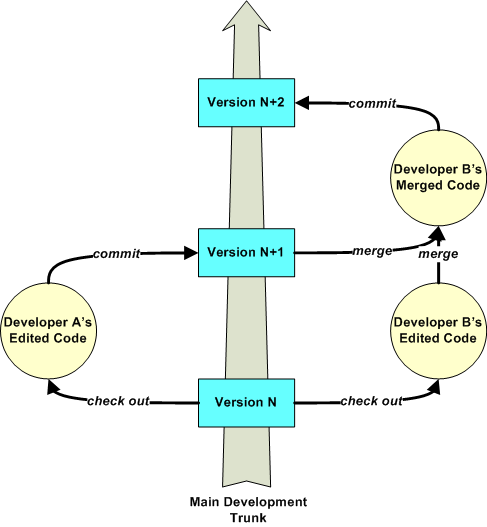

Credit by rice.edu, originate from <a href="https://www.clear.rice.edu/comp310/Eclipse/Subclipse/subversion.html">https://www.clear.rice.edu/comp310/Eclipse/Subclipse/subversion.html ↗</a>
  
至今世界上还有很多陈年项目是使用 SVN 进行版本管理的, 长年的折磨之下猿们也学会了以曲线救国的方式来模拟分支, 比如私自开小坑:
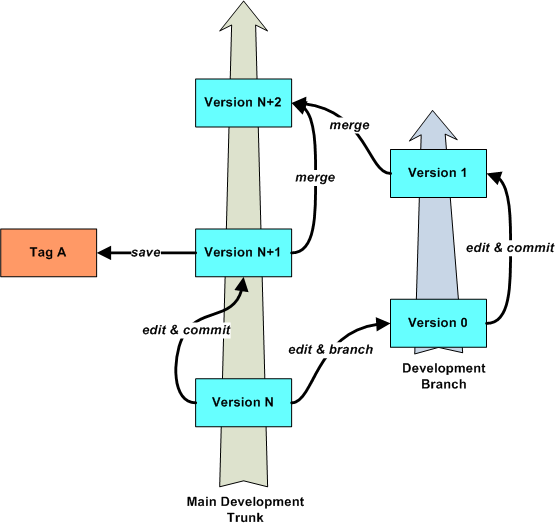

Credit by rice.edu, originate from <a href="https://www.clear.rice.edu/comp310/Eclipse/Subclipse/subversion.html">https://www.clear.rice.edu/comp310/Eclipse/Subclipse/subversion.html ↗</a>

(对此我只能表示...(=^ ・ω・^=)  

好了我们扯回 git.
如果你们已经做过需要组队完成的课程设计作业, 那你们一定进行过类似这样的流程: 拿到一个大任务(Epic) → 按人员拆分每个人负责一部分(Task & Assign) → (各自完成任务) → 归集各人的成果并进行组装 → 测试装配起来的成品是否符合初期目标 → 更改部件和重新组装, 重复直至满足目标为止.  
在之前的实验中我们已经完成...呃...大概第三步的工作了, 一切都很顺利. 但之后就会变成噩梦, 组长为了组装各个部件可能需要对不具合的部分进行修剪和删改. 以人力来完成会非常...蛋疼(比如思政的那些××调查报告之类).  
分支为这种场景提供解决方案. 通过和队友准实时地共享工作状态, 可以解决闭门造车的问题. git 则为分支提供进一步支持, 所有人每次提交的细节(改了哪些文件的哪些行, 谁改的, 谁先谁后...)都被记录在案, git 则利用这些信息来进行自动合并或者辅助人工合并.  
分支有如下一些特性:
1. 和植物的芽一样, 分支可以从任意 commit 分出. 在之前实验的分支操作中, 对话框还有一个字段是 `Starting Revision`, 可以从这里选择分支点.
2. 分支可以相互合并, 如果没有冲突, git 可以按预期的结果自动合并不同分支间的差异. 
3. 分支可以随便命名, 所以你想叫它做猫又或者九摩诃都是可以的. 一个仓库最开始的分支名字叫做 master, 这也是可以随意更改的. 通常将 master 作为主要分支, 专用于汇合所有人的提交. 
4. 分支在每个远程仓库中通常有一个同名的 `跟踪分支(Tracking Branch)`, 表示这个分支在另一个仓库的同位物.
5. gitk中, 分支名带有嫩肉色前缀的分支表示远程分支, 表示对应跟踪分支的位置, 在 fetch 操作时自动更新. 通常无法手动更改.
6. 因为跟踪分支存在于另一个仓库中, 远程分支只是跟踪分支在本地的影, 所以位于本地仓库的本体和跟踪分支在物理上是两个分支.(看不懂的请无视)
7. 因为(某分支的)跟踪分支和(该跟踪分支的)远程分支其实只是影与本体的区别, 所以在无歧义的情况下通常将两者混用.  
8. 一个分支(包括其跟踪分支)通常只由一个人写. 多个人写同个分支会退化成线性的情况, 最终结果是像 SVN 一样产生大量冲突.

### 合并更改, 以及冲突(Conflict)

在之前的实验中我们已经实践了一次合并(`origin/master` → `master`, 实质相同的分支相互吸收本质其实也是合并). 接下来的实验演示合并实质不同的分支(真・合并)以及解决冲突.

1. Carol 启动 git-gui, 选择 `远端(Remote)` → `从...提取(Fetch from)` → `origin`
2. (等待 git 从 Github 取得 Alice 的更新)
   
至此已经从 Github 取得 Alice 的更改, 并保存在 origin/master 上; 取得 Bob 的更改, 并保存在 <i>origin/branch-bob</i> 上

3. 选择 `分支(Branch)` → `Checkout` → `master`, 切换到 `master` 分支.
3. 选择 `合并(Merge)` → `本地合并(Local Merge)`. 现在 Carol 应该处于 master 分支上, 应该会出现 `Merge Into master` 的字样.
4. 选择 `跟踪分支(Tracking Branch)` → `origin/master` → `合并(Merge)`.
   
至此已经将 Alice 的更改应用到本地, Carol 正在编辑的文件(Working Copy)会同时被修改. Bob 的更改未被引入.

6. 选择 `分支(Branch)` → `新建分支(Create)` , 名字可以随便决定, 在此我们以 <i>branch-carol</i> 为例.
   
关于 <i>分支(Branch)</i> 的概念会在下一节讲解.

7. 写代码: 

		// HelloWorld.java
		
		import java.util.Random;
		
		public class HelloWorld {
		    public static String randomString(int i) {
		        Random ran = new Random(i);
		        StringBuilder sb = new StringBuilder();
		        while (true) {
		            int k = ran.nextInt(27);
		            if (k == 0)
		                break;
		
		            sb.append((char)(64 + k));
		        }
		
		        return sb.toString();
		    }
		
		    public static void main(String[] args) {
		        System.out.println(randomString(-229985452) + " " + randomString(-147909649));
		    }
		}

8. 按上一节讲述的方法进行 <i>提交</i> 和 <i>上传</i>.

在此假设 Alice 是项目组组长, 负有整合项目的职责, 接下来她需要这么做:

1. 通过 fetch 取得 <i>branch-bob</i>, 和 <i>branch-coral</i>.
2. 确认处于 master 分支上, 否则使用 checkout 转移到 master 上.
3. 使用 merge 将

(前方仍在施工)

## 5. Build software better, together.

嗯, Github 的口号...
很难定义 Github 是什么, 他不是单纯的软件仓库, 不是社交网络, 不是协作工具, 虽然它样样都占点边.
围绕 git 的版本管理功能, 它扩展了很多好玩的功能, 使写代码变成一件相当有趣的事.(蓝星人就知道刷微博...唉)

好吧正题...

### Timeline & Dashboard
登录之后的第一个画面就是 Timeline, 不过通常都没啥好看的, 因为大部分信息都没有价值.

随便戳一个人的名字会去到他的个人主页(比如[副主任的](https://github.com/cuter44))左边是 biography, 自己在 settings 填写. 右侧分了好几块, 从上到下分别是:
 
* 页签 切换 活动数据, 仓库列表, (那个用户的)timeline , 后两个不解释了.
* 热门仓库 显示这个用户写的热门内容.
* 贡献 显示活跃度, 某些人会喜欢把那个列表刷到全绿... 不过如果[参拜过 Linus 大神的 Github 帐号](https://github.com/torvalds), 呵呵.
* 然后戳上面的小格子下面会列出具体的内容.

哦对了, 访问别人的主页时右上角会有 <button class="btn btn-success">Follow</button> 按钮, 不解释. 

### Repository
当遇见喜欢的 repo, 比如[这篇教程](https://github.com/scau-sidc/git-tutorial), 可以使用右上角有三个操作 <button class="btn btn-default">Φ Watch</button><button class="btn btn-default">★ Star</button><button class="btn btn-default">Υ Fork</button>. 它们大致对应于蓝星微博的 收藏 点赞 转发 操作, 更详细的含义请自行在[Github的帮助系统](https://help.github.com/)搜索.
旁边的数字表示 Watch/Star/Fork 这个仓库的人数, 戳进去可以看具体是谁.

### Issues
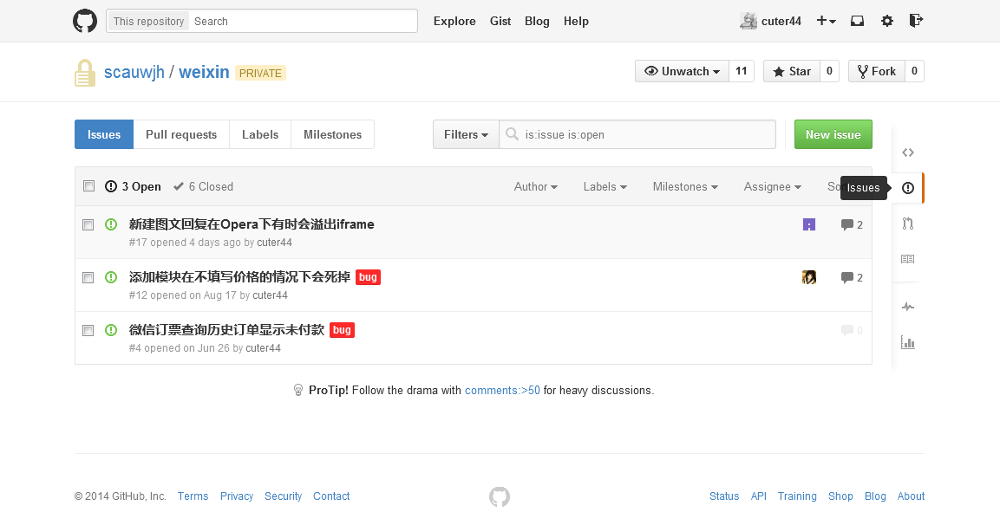
每个仓库都会附带一个轻量级的跟踪系统, 可以用于 你发现bug并且想报告给作者/向作者提问提建议/请求队友协助(比如要求新的API)/记录自己的待办事项, 用法和 teamibition 的任务版大同小异, 这里就不再展开说了.

### Wiki
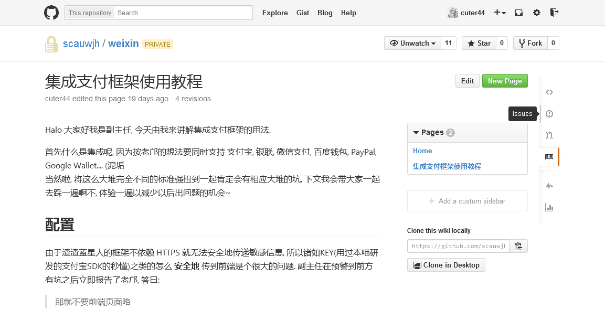

如果作者愿意, 会开放并且撰写 Wiki. Wiki 通常用于弥补文档注释的不足, 用来放置用户文档或者系统文档. 不过就实际使用情况来说, 其实不是那么方便...

并且...像副主任这种乐于写文档的业界良心已经不多了...

### Pull Request
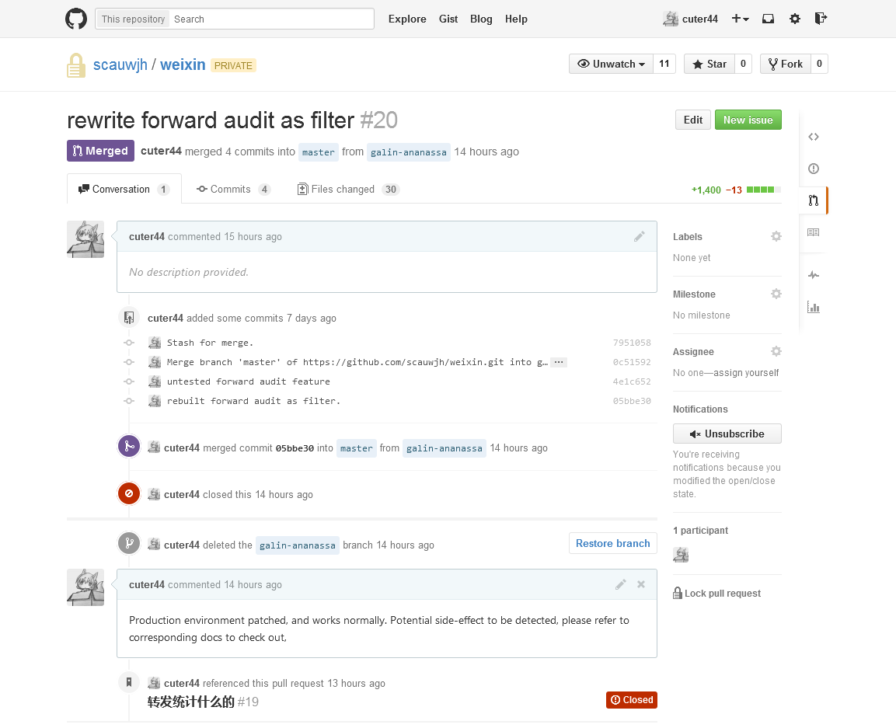
前面我们教了上传(push), 能使用 push 的前提条件是你对远程仓库有写权限. 举个栗子, 刚刚我们用于订外卖的仓库, 只所以强调要提前加入组织就是为了授予对仓库的写权限. 如果没有写权限而又想要往仓库推送内容的话, 就应该使用 Pull Request 操作.

<abbr title="Pull Request">PR</abbr> 是 Github 特有的操作.

1. 首先要将自己的分支(在这里是`galin`)上传到 Github.
2. 然后登入到项目, 会看到下图的提示, 果断点<button class="btn btn-success">Compare &amp; pull request</button>.
   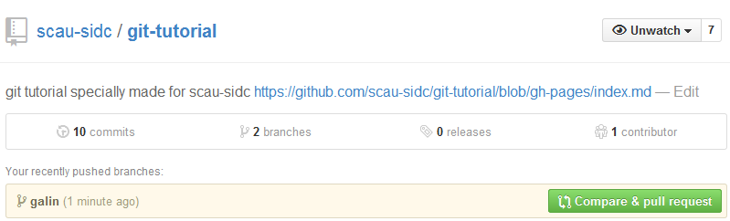
3. 然后接下来的操作与 commit 类似, 它要求你给出这个 PR 的提交描述, 所以应该按提交描述的规范认真写, 完成之后按 <button class="btn btn-success">Create pull request</button>.  
4. (跳转到PR详情页面), 整个页面包含了 你写的 PR 摘要, 包含的 commit, 文件的diff

然后仓库的主人和这个 PR 的责任者会收到邮件. 然后他会检查你的 PR, 从而选择接受或者拒绝你的提交. 到这里 PR 就完成了, 界面看上去会变成题图的样子.

PR 的应用场景包括但不限于以下几种:  

* 从仓库外(别人fork你的)接受提交
* 同一个工作组中, 有一个大牛做负责人, 大牛规定所有代码要由他过目才能汇集到主分支.
* 自己给自己发 PR(当备忘使用)

### Github Pages
就是你正在看这篇教程所依赖的托管服务了, 它会将当前目录的 `gh-pages` 发布成静态网站. 并且支持一种名为 [jekyll](http://jekyllrb.com/) 的脚本语言. 嗯...然后, 你懂的.  Where there is an API, there is a way.
比如[本工作室的博客](http://scau-sidc.github.io/)就是几只大牛<del>利用业余时间</del>受老邝所迫撸出来的.

### Gist
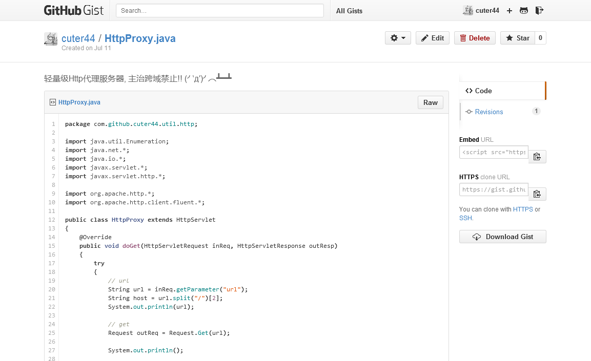
经常会有一些小脚本你想抄起来以后用, 但它本身的规模又没大到需要专门建个仓库去安置它.  
Gist就是用来满足这种需求的. 随手写, 随时用, 闲得慌了还能"手气不错"一下.

## 6. 某超科学的<del>附录</del>黑历史

### 超科学的提交描述文法

最开始工作室开荒的时候, 大家都不是很懂, 于是提交描述各种乱来...

    整合

↑ 整合了啥没说, 还是要翻代码

有时还会看到些嘲讽向的:

    没修改什么

没修改什么你交个毛线!! (＃°д°)

于是乎, 久病成良医, 慢慢地琢磨出一套标准:  

    登录/激活功能追加完成
    
    + Web API, 详情请参见javadoc
      + /authorize/register
        ! 现在还不能发邮件, 但是会通过json返回激活之必要参数
      + /authorize/activate
      * /authorize/login
        + 追加了样例
      * /authorize/logout
        + 追加了样例
      * /authorize/getRsaKey
    + 追加Criteria机能, 详请参考wiki:Criteria
    + 追加了用于RSA加密的实用工具, 详请参考wiki:服务器部署指南

提交的标题不说了, 很容易就能总结出来.
然后下面以树状的方式列出更新的内容. 前导的符号表示更新的类型, `+` 表示新增, `*` 表示修改, `-` 表示删除, 这些和 `git diff` 的表示法相容. 需要额外注意的内容则用 `!` 表示.

### 超科学的分支命名法
有一些约定俗成的命名规则:

* 如果你的仓库是以 `git clone` 拷贝回来的, 那么源仓库会被命名为 origin, 也就是 本源 的意思, 在命令行执行 `git fetch` `git push` 且没有指定远程仓库的名字时, 会默认使用这个.
* 主分支通常命名为 `master`, 用于存放用于发布的稳定版本. 且作为[软件基线](http://baike.baidu.com/view/2113289.htm)(发布基线).
* 通常会有一个开发分支 `develop`, 用于收集和积淀开发过程中的功能性更新, 且作为软件基线(开发基线). 通常这两个基线的每一个提交都要求是完备的, i.e. 能够正确编译且通过全部测试用例(不过工作室一直以来都没测试管理, 所以说了也白说...).
* 然后...没了, 更规范的实践推荐看这个<a href="http://nvie.com/posts/a-successful-git-branching-model/"><i>A successful Git branching model</i></a> By <i>Vincent Driessen</i> (<a href="http://segmentfault.com/a/1190000000434973"><i>git分支最佳实践</i></a> 由 SegmentFault 翻译)   

--------------

后记

妈蛋这又不是轻小说写毛线后记(╯‵д′)╯︵┻━┻
进阶版再说吧...

